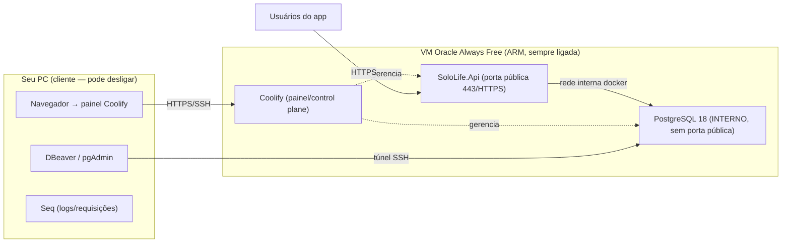

# Playbook — Hospedagem self-host do SoloLife (Oracle Cloud Always Free + Coolify + PostgreSQL 18)

> **Objetivo:** subir o backend SoloLife na sua própria infra, de graça, com PostgreSQL 18, um painel web pra gerenciar (estilo "Aiven particular"), backups e HTTPS — mantendo o banco **interno** (não exposto à internet) e a API como única porta pública.

## Visão geral da arquitetura



**Regra de ouro:** o **host e o banco** ficam na VM (sempre ligada); o **PC** é só cliente/monitor. Se o PC desliga, nada cai.

---

## Pré-requisitos

- Conta na Oracle Cloud (precisa de cartão **só para verificação** — não cobra dentro do Always Free).
- Um par de chaves SSH (`ssh-keygen -t ed25519`).
- (Opcional, recomendado) um domínio para a API e para o painel (ex.: `api.seudominio.com`, `painel.seudominio.com`) — habilita HTTPS Let's Encrypt automático.
- No seu PC: um cliente SSH e o **DBeaver** (ou pgAdmin/TablePlus).

> ⚠️ **Cota A1 (ARM):** desde 15/06/2026 o Always Free Ampere é **2 OCPU / 12 GB** (antes 4/24). Ainda sobra folga (Coolify pede 2 CPU/2 GB). A capacidade A1 em regiões populares às vezes falta — se der "out of capacity", tente outra região/AD ou repita mais tarde.

---

## Parte A — Provisionar a VM

1. **Region/Compartment:** escolha uma região próxima (ex.: `sa-saopaulo-1` / `sa-vinhedo-1` para latência no Brasil).
2. **Compute → Instances → Create Instance:**
   - **Image:** Canonical **Ubuntu 24.04** (ou 22.04).
   - **Shape:** `VM.Standard.A1.Flex` (Ampere/ARM) → **2 OCPU / 12 GB**.
   - **SSH keys:** cole sua chave pública.
   - **Boot volume:** 50–100 GB já basta (limite Always Free agregado é 200 GB).
   - **Networking:** crie/reutilize uma VCN com subnet pública e IP público.
3. **Abrir portas na Security List** (VCN → Subnet → Security List → Ingress Rules), Source `0.0.0.0/0`:
   - `TCP 80` e `TCP 443` (API + painel via HTTPS).
   - `TCP 22` — de preferência **restrito ao seu IP** (`SEU.IP/32`).
   - **NÃO** abra `5432`. O banco fica interno.
4. **Conectar:** `ssh ubuntu@SEU_IP_PUBLICO`.

---

## Parte B — Hardening básico do servidor (faça ANTES do Coolify)

> Self-host = a segurança é sua. Este é o mínimo inegociável.

```bash
# 1) Atualizar o SO
sudo apt update && sudo apt upgrade -y

# 2) ⚠️ GOTCHA da Oracle: a imagem Ubuntu vem com iptables travado.
#    Libere 80/443 ANTES da regra REJECT (senão o Let's Encrypt e o app não respondem).
sudo iptables -I INPUT 6 -m state --state NEW -p tcp --dport 80 -j ACCEPT
sudo iptables -I INPUT 6 -m state --state NEW -p tcp --dport 443 -j ACCEPT
sudo netfilter-persistent save

# 3) Swap (a VM tem RAM ok, mas swap evita OOM em picos de build)
sudo fallocate -l 4G /swapfile && sudo chmod 600 /swapfile
sudo mkswap /swapfile && sudo swapon /swapfile
echo '/swapfile none swap sw 0 0' | sudo tee -a /etc/fstab

# 4) fail2ban (bloqueia brute-force de SSH)
sudo apt install -y fail2ban
```

Endureça o SSH em `/etc/ssh/sshd_config` (`PasswordAuthentication no`, `PermitRootLogin no`) e `sudo systemctl restart ssh`. **Confirme que você consegue logar por chave em outra aba antes de fechar a sessão atual.**

---

## Parte C — Instalar o Coolify

```bash
curl -fsSL https://cdn.coollabs.io/coolify/install.sh | sudo bash
```

- Acesse `http://SEU_IP:8000` → crie a conta **admin** (use senha forte; ative 2FA em *Profile → Two-Factor*).
- O painel é poderoso (controle de root sobre o servidor) — **nunca** deixe sem senha forte/2FA, e idealmente sirva-o por domínio com HTTPS.
- (Opcional) **Domínio do painel:** *Settings → Instance Domain* → `https://painel.seudominio.com` (aponte o DNS A para o IP). O Coolify cuida do Let's Encrypt.

---

## Parte D — Criar o PostgreSQL 18

1. No projeto padrão: **+ New → Database → PostgreSQL**.
2. Em **Image**, troque para **`postgres:18`**.
3. ⚠️ **Workaround do PG18 (issue Coolify #7279):** o PG18 exige um único mount em `/var/lib/postgresql`. Após criar, vá em **Database → Configuration → Persistent Storage** e troque o destino de `/var/lib/postgresql/data` para **`/var/lib/postgresql`**, depois **Restart**. (Quando o template "PostgreSQL 18" virar default, isso some.)
4. **Não habilite "Public Port".** Deixe o banco **interno**. Anote a **Internal Connection URL** que o Coolify mostra (algo como `postgres://postgres:SENHA@<nome-interno>:5432/postgres`).
5. **Backups:** *Database → Backups* → agende (ex.: diário) com **retention** e destino **S3 compatível** (ou local). Em *Settings → S3 Destinations* você pode usar um bucket (inclui MinIO/Backblaze B2/Cloudflare R2).
6. (Opcional) **Database SSL:** se um dia expor o banco, ative aqui (gera CA própria; o cliente usa `SSL Mode=VerifyFull` com essa CA).

### Aplicar as migrations (`.migrations/*.sql`)

O Coolify cria o banco vazio. Aplique seu schema **uma vez** via túnel SSH (sem expor o banco):

```bash
# No seu PC: descubra o nome/porta interna do container no painel, ou use a porta mapeada.
# Túnel SSH encaminhando a porta do Postgres do container para o seu PC:
ssh -L 5432:localhost:<porta-interna-do-coolify> ubuntu@SEU_IP
```

Com o túnel aberto, no DBeaver conecte em `localhost:5432` e rode, **nesta ordem**:
`.migrations/V001__initial_schema.sql` → `V002__...` → `V003__...`
(eles já fazem `CREATE SCHEMA IF NOT EXISTS sololife; SET search_path TO sololife;`).

> 💡 Alternativa: use o **terminal web do Coolify** no contêiner do Postgres e rode `psql -U postgres -d sololife -f ...` colando cada arquivo.
> 🔜 **Futuro:** trocar esse passo manual por um migrator de verdade (DbUp/Grate apontando para `.migrations/`) rodado no boot da API. Ver seção *Trabalho futuro*.

---

## Parte E — Deploy da SoloLife.Api (mesmo box)

A API vai conversar com o banco pela **rede interna** do Coolify (sem SSL, sem internet no meio → mais simples e seguro).

### E.1 — Dockerfile (criar na raiz do repo)

```dockerfile
FROM mcr.microsoft.com/dotnet/sdk:10.0 AS build
WORKDIR /src
COPY . .
RUN dotnet restore SoloLife.slnx
RUN dotnet publish src/SoloLife.Api -c Release -o /app

FROM mcr.microsoft.com/dotnet/aspnet:10.0
WORKDIR /app
COPY --from=build /app .
EXPOSE 8080
ENV ASPNETCORE_URLS=http://+:8080
ENTRYPOINT ["dotnet", "SoloLife.Api.dll"]
```

> As imagens base do .NET 10 são multi-arch — buildam em **arm64** nativamente na VM Oracle.

### E.2 — Recurso no Coolify

- **+ New → Application → Public/Private Repository** (aponte para o repo do SoloLife) → **Build Pack: Dockerfile**.
- **Porta exposta:** `8080`. Defina o **domínio** `https://api.seudominio.com` (Let's Encrypt automático).
- **Environment Variables** (em *Environment Variables*, marque como *secret*):

```
ASPNETCORE_ENVIRONMENT=Production
ConnectionStrings__Default=Host=<nome-interno-do-db>;Port=5432;Database=sololife;Username=postgres;Password=<SENHA>;Maximum Pool Size=20
Jwt__Secret=<um-secret-aleatorio-de-32+caracteres>
Jwt__Issuer=SoloLife
Jwt__Audience=SoloLifeApp
```

> `ConnectionStrings__Default` (duplo underscore) sobrescreve `ConnectionStrings:Default` sem tocar no código (`DependencyInjection.cs` lê `GetConnectionString("Default")`). Como o tráfego API↔banco é interno ao Docker, **não precisa de SSL** nessa string. Gere o secret com `openssl rand -base64 48`.

---

## Parte F — Validar

- Acesse `https://api.seudominio.com/swagger` (Swagger só aparece em Development; em Production teste um endpoint real, ex.: registro/login).
- Confira no painel do Coolify: contêiner **healthy**, logs sem erro de conexão.
- No DBeaver (via túnel) rode `SELECT version();` → deve dizer **PostgreSQL 18.x**, e veja as tabelas no schema `sololife`.

---

## Parte G — Monitoramento (o trio, sem construir nada)

| O que ver | Ferramenta | Como |
|---|---|---|
| Host (CPU/RAM/disco), contêineres, deploy, logs | **Coolify** (web) | já incluso no painel |
| Conexões ativas, queries, tabelas | **DBeaver/pgAdmin** | `SELECT * FROM pg_stat_activity;` |
| Queries lentas/frequentes | extensão `pg_stat_statements` | `CREATE EXTENSION pg_stat_statements;` + ajuste no `postgresql.conf` |
| **Requisições HTTP** (rota, status, tempo, erros) | **Seq** | já que o Serilog + `UseSerilogRequestLogging()` estão ligados |

### Habilitar o Seq (monitor de requisições)

1. Suba o **Seq** como mais um recurso no Coolify (imagem `datalust/seq`, porta 80, env `ACCEPT_EULA=Y`) — ou rode local no seu PC para dev.
2. No `SoloLife.Api`, adicione o pacote: `dotnet add src/SoloLife.Api package Serilog.Sinks.Seq`.
3. Em `appsettings.json`, na seção `Serilog.WriteTo`, acrescente o sink (o Serilog já lê de config):

```json
"WriteTo": [
  { "Name": "Console" },
  { "Name": "Seq", "Args": { "serverUrl": "http://<seq-interno>:80" } }
]
```

(Use a URL interna do Seq no Coolify, ou `http://localhost:5341` em dev.) Pronto — todas as requisições aparecem no Seq, sem mais código.

---

## Checklist de segurança (consolidado)

- [ ] SSH só por chave; porta 22 restrita ao seu IP; `fail2ban` ativo.
- [ ] iptables liberando **só** 80/443 (e 22); **5432 fechado** ao mundo.
- [ ] Postgres **interno** — sem "Public Port". Acesso de fora só por túnel SSH.
- [ ] Painel Coolify com **senha forte + 2FA**, servido por HTTPS.
- [ ] **Remover o fallback hardcoded** de `Jwt:Secret` no `Program.cs:38` (`?? "change-me-..."`) — em Production o secret deve vir **só** da env var; se faltar, falhe explicitamente.
- [ ] Secrets (`ConnectionStrings__Default`, `Jwt__Secret`) **só** em env vars do Coolify; nunca commitados. `appsettings.json` fica com placeholders/vazios.
- [ ] **Backups agendados** ativos e testados (faça um *restore* de teste — backup não testado não é backup).
- [ ] Coolify + SO atualizados (auto-update do Coolify ligado).

---

## Custos

**R$ 0** dentro do Oracle Always Free (VM A1 + 200 GB). Únicos pontos: cartão para verificação (sem cobrança), e backups para S3 externo podem ter custo de egress se o bucket não for free (R2/B2 têm tiers grátis generosos).

---

## Trabalho futuro

- **Migrator real:** substituir a aplicação manual dos `.sql` por DbUp/Grate (idempotente, com catálogo de versões) rodado no boot da API.
- **`docker-compose` para distribuição:** para outros rodarem 100% local sem instalar nada, um `docker-compose.yml` com `postgres:18` + `.migrations/` montado em `/docker-entrypoint-initdb.d/`. (Mecanismo roda só na 1ª subida do volume.)
- **Painel desktop `.exe` (.NET):** mission control próprio (Coolify API + `pg_stat_*` + Seq) — **adiado para depois do MVP**.
- **Escala/HA:** uma VM = ponto único de falha. Para lançamento sério, considerar VM maior, réplica de leitura, ou migrar o banco para gerenciado (Neon/Aiven free já são PG18).
```
